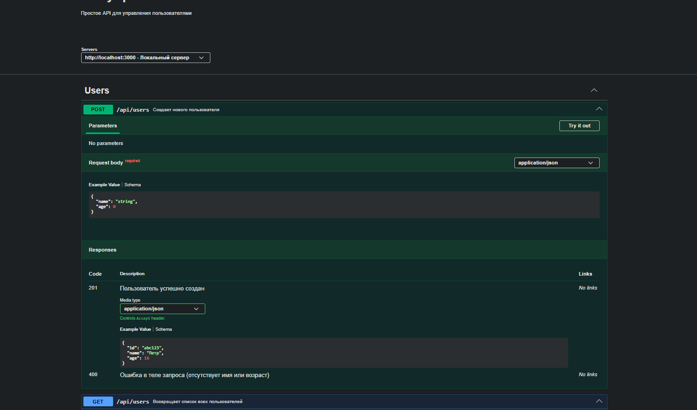
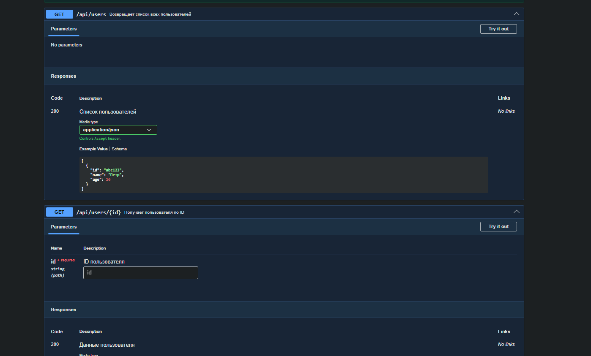
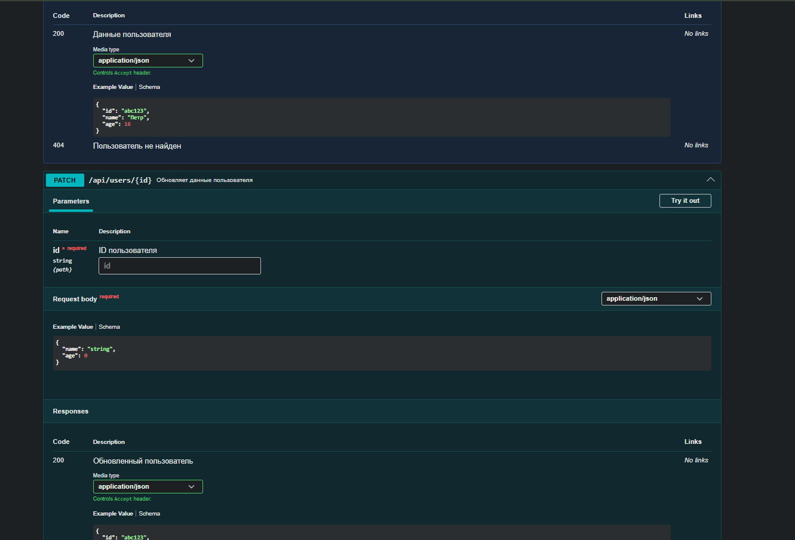
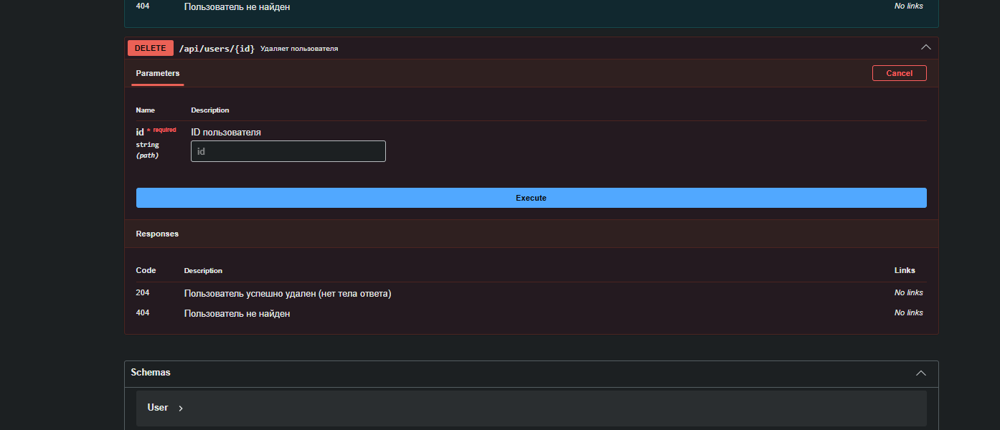

# Практика 5: Расширенный REST API и Swagger

В данном проекте реализовано управление пользователями (CRUD) через Express.js с автоматической генерацией документации Swagger.

## Скриншоты работы:

